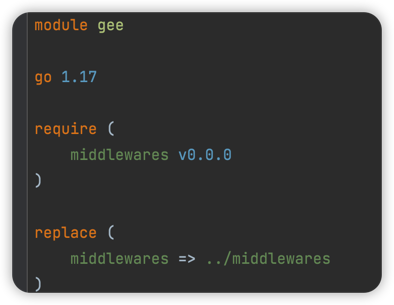
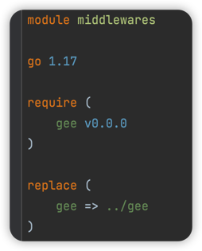
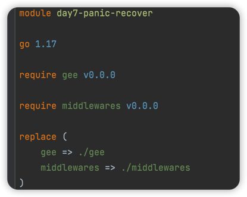
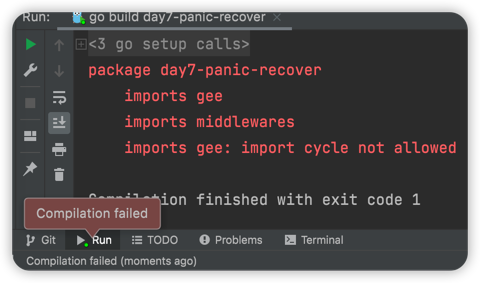

## day7-panic-recovery(2022.4.11)

### 内容

-实现Gee框架的错误处理机制，避免因为一个panic而整个服务崩溃

### 步骤

-简单处理，就是添加一个全局中间件`recovery`

### 疑问

我在`gee`包中，想实现一个`gee.Default()`
函数返回一个默认的`Engine`实例，就是想其中预先加入部分中间件，那就会引用到`middlewares`包中的函数。 在`gee`目录下的`go.mod`文件里面引入`middlewares`，同时我也已经在`middlewares`
包里面引入了`gee`。 此时都没报错，但是我在`day7-panic-recover`目录下的`go.mod`引入`gee`包和`middlewares`包就会报错（因为在`main`函数里面会用到`gee.Default()`）

